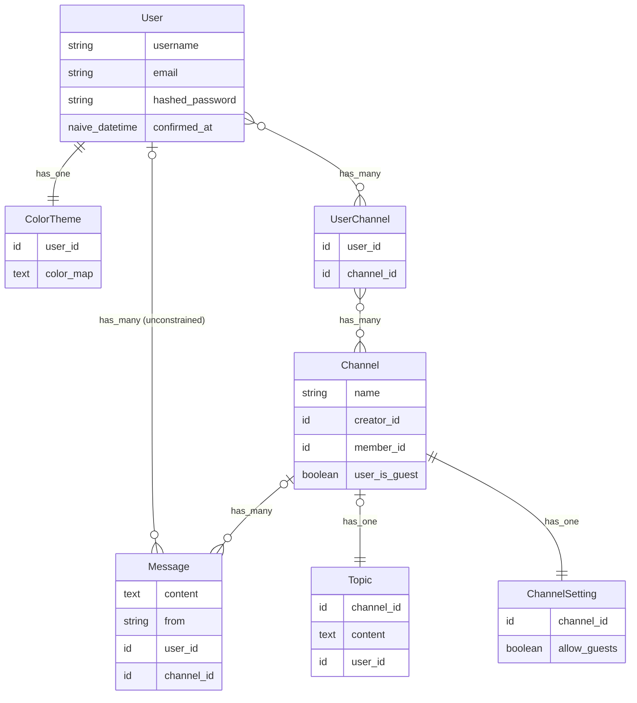

# WeexChat

Setup database as docker container

```sh
docker run -d -p 5433:5432 --name=postgres \
-e POSTGRES_PASSWORD=postgres \
-e PGDATA=/var/lib/postgresql/data/pgdata \
-v ~/postgres_data:/var/lib/postgresql/data \
-d postgres:15.3
```

Setup environment variables config `.env`

```sh
export POSTGRES_USERNAME="postgres"
export POSTGRES_PASSWORD="postgres"
export POSTGRES_HOSTNAME="localhost"
export POSTGRES_PORT=5433
```

Load configuration variables from `.env` into your current shell

```sh
source .env
```

Verify environment variables are loaded

```sh
echo $POSTGRES_USERNAME
```

Ecto.Query

```sh
iex> import Ecto.Query
Ecto.Query

iex> from(u in "users_channels", select: [u.user_id, u.channel_id]) |> WeexChat.Repo.all()
[debug] QUERY OK source="users_channels" db=1.8ms idle=1880.2ms
SELECT u0."user_id", u0."channel_id" FROM "users_channels" AS u0 []
↳ anonymous fn/4 in :elixir.eval_external_handler/1, at: src/elixir.erl:309

iex> Ecto.Adapters.SQL.query(WeexChat.Repo, "INSERT INTO users_channels (user_id, channel_id) VALUES (2, 2)")
[debug] QUERY OK db=5.9ms queue=0.7ms idle=1369.8ms
INSERT INTO users_channels (user_id, channel_id) VALUES (2, 2) []
{:ok,
 %Postgrex.Result{
   command: :insert,
   columns: nil,
   rows: nil,
   num_rows: 1,
   connection_id: 1419,
   messages: []
 }}

iex> from(u in "users_channels", select: [u.user_id, u.channel_id]) |> WeexChat.Repo.all()
[debug] QUERY OK source="users_channels" db=1.5ms idle=1088.7ms
SELECT u0."user_id", u0."channel_id" FROM "users_channels" AS u0 []
↳ anonymous fn/4 in :elixir.eval_external_handler/1, at: src/elixir.erl:309
[[2, 2]]
```

Start the Phoenix server

- Run `mix setup` to install and setup dependencies
- Start Phoenix endpoint with `mix phx.server` or inside IEx with `iex -S mix phx.server`

Visit [`localhost:4000`](http://localhost:4000) from your browser.

## Entity-Relationship Diagram


