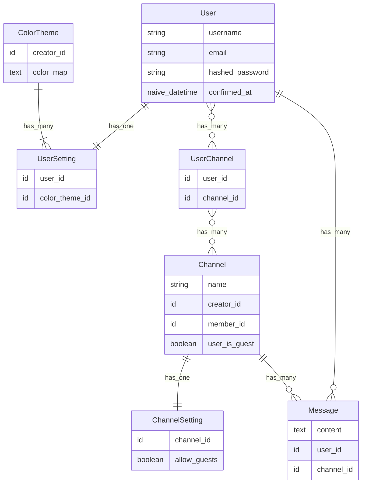

# WeexChat

To start the Phoenix server:

- Run `mix setup` to install and setup dependencies
- Start Phoenix endpoint with `mix phx.server` or inside IEx with `iex -S mix phx.server`

Now visit [`localhost:4000`](http://localhost:4000) from your browser.

## Entity-Relationship Diagram

