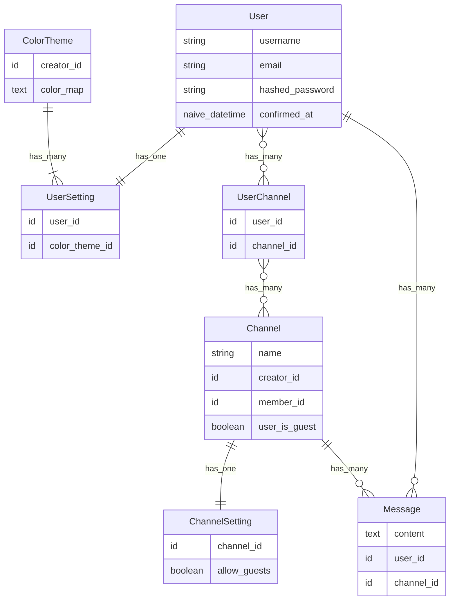

# WeexChat

Setup database as docker container

```sh
docker run -d -p 5433:5432 --name=postgres \
-e POSTGRES_PASSWORD=postgres \
-e PGDATA=/var/lib/postgresql/data/pgdata \
-v ~/postgres_data:/var/lib/postgresql/data \
-d postgres:15.3
```

Setup environment variables config `.env`

```sh
export POSTGRES_USERNAME="postgres"
export POSTGRES_PASSWORD="postgres"
export POSTGRES_HOSTNAME="localhost"
export POSTGRES_PORT=5433
```

Load configuration variables from `.env` into your current shell

```sh
source .env
```

Verify environment variables are loaded

```sh
echo $POSTGRES_USERNAME
```

Start the Phoenix server

- Run `mix setup` to install and setup dependencies
- Start Phoenix endpoint with `mix phx.server` or inside IEx with `iex -S mix phx.server`

Visit [`localhost:4000`](http://localhost:4000) from your browser.

## Entity-Relationship Diagram


